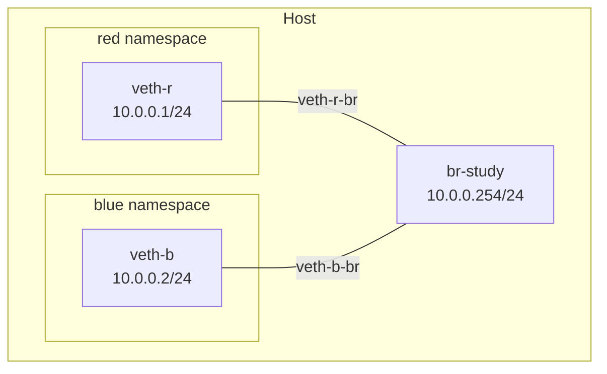

# Lesson 0 Exercises: Container Networking -- Linux Under the Hood

Complete these exercises to reinforce your understanding of the Linux primitives under container networking.

```bash
cd lessons/clab/00-docker-networking
```

## Exercise 1: Inspect Docker's Network Plumbing

**Objective:** Trace the Linux components Docker creates when you run containers.

### Steps

1. Start two containers on the default bridge:
   ```bash
   docker run -d --name c1 alpine sleep 3600
   docker run -d --name c2 alpine sleep 3600
   ```

2. Find the `docker0` bridge on the host:
   ```bash
   ip link show docker0
   ```

3. List all interfaces attached to `docker0`:
   ```bash
   ip link show master docker0
   ```
   Note the veth names, their interface indexes (the number before the colon), and the `link-netnsid` values.

4. Look inside container `c1` and find the other end of the veth pair:
   ```bash
   docker exec c1 ip addr
   ```
   Inside the container, `eth0` shows `@ifN` -- that N is the interface index of the host-side veth. Find that index in the host output from step 3 to match the pair.

5. Check the container's routing table:
   ```bash
   docker exec c1 ip route
   ```

6. Verify with Docker's own view:
   ```bash
   docker network inspect bridge
   ```

### Think about it

- What is the IP of the `docker0` bridge, and how does it relate to the container's default gateway?
- How do you match a host-side veth to its container-side eth0? (Hint: start from inside the container and look at the `@ifN` index.)
- What subnet does Docker use for the default bridge?

### Cleanup

```bash
docker rm -f c1 c2
```

---

## Exercise 2: Build a Container Network from Scratch

**Objective:** Manually create a namespace-based network using bridges and veth pairs -- the same primitives Docker uses.

### Architecture



### Steps

1. Create two network namespaces:
   ```bash
   sudo ip netns add red
   sudo ip netns add blue
   ```

2. Verify they exist:
   ```bash
   sudo ip netns list
   ```

3. Create a Linux bridge and assign it an IP:
   ```bash
   sudo ip link add br-study type bridge
   sudo ip link set br-study up
   sudo ip addr add 10.0.0.254/24 dev br-study
   ```

4. Create veth pairs and wire up the **red** namespace:
   ```bash
   sudo ip link add veth-r type veth peer name veth-r-br
   sudo ip link set veth-r netns red
   sudo ip link set veth-r-br master br-study
   sudo ip link set veth-r-br up
   ```

5. Create veth pairs and wire up the **blue** namespace:
   ```bash
   sudo ip link add veth-b type veth peer name veth-b-br
   sudo ip link set veth-b netns blue
   sudo ip link set veth-b-br master br-study
   sudo ip link set veth-b-br up
   ```

6. Configure IPs and bring interfaces up inside each namespace (but **not** the loopback yet):
   ```bash
   # Red
   sudo ip netns exec red ip addr add 10.0.0.1/24 dev veth-r
   sudo ip netns exec red ip link set veth-r up

   # Blue
   sudo ip netns exec blue ip addr add 10.0.0.2/24 dev veth-b
   sudo ip netns exec blue ip link set veth-b up
   ```

7. Test connectivity between namespaces:
   ```bash
   # Red to blue
   sudo ip netns exec red ping -c 3 10.0.0.2

   # Blue to red
   sudo ip netns exec blue ping -c 3 10.0.0.1

   # Either namespace to the bridge gateway
   sudo ip netns exec red ping -c 2 10.0.0.254
   ```

8. Now try pinging the loopback address inside a namespace:
   ```bash
   sudo ip netns exec red ping -c 2 127.0.0.1
   ```
   It fails. Why? The loopback interface (`lo`) starts in a DOWN state in new namespaces.

9. Bring up the loopback in both namespaces and verify:
   ```bash
   sudo ip netns exec red ip link set lo up
   sudo ip netns exec blue ip link set lo up
   sudo ip netns exec red ping -c 2 127.0.0.1
   ```

### Think about it

- Why did `127.0.0.1` fail before bringing up `lo`, even though pinging the other namespace worked? What does this tell you about how loopback differs from bridge-connected interfaces?
- Run `ip link show master br-study` on the host. What does each line tell you?
- How is your manual setup different from what Docker does with `docker0`? (Hint: Docker automates these exact steps.)

---

## Exercise 3: Enable Internet Access (NAT)

**Objective:** Add NAT/masquerade rules so your manual namespaces can reach the internet, just like Docker containers.

### Prerequisites

Complete Exercise 2 first (namespaces, bridge, and veth pairs must be in place).

### Steps

1. First, find your host's outbound interface:
   ```bash
   ip route show default
   ```
   Note the interface name after `dev` (e.g., `enp6s0`, `enp0s3`, `wlan0`). On modern Linux this is **not** `eth0` -- use whatever your system shows.

2. Add default routes in each namespace so they send non-local traffic to the bridge:
   ```bash
   sudo ip netns exec red ip route add default via 10.0.0.254
   sudo ip netns exec blue ip route add default via 10.0.0.254
   ```

3. Enable IP forwarding on the host:
   ```bash
   sudo sysctl -w net.ipv4.ip_forward=1
   ```

4. Allow forwarding for br-study. Docker sets the FORWARD chain policy to DROP, which blocks our traffic:
   ```bash
   sudo iptables -A FORWARD -i br-study -j ACCEPT
   sudo iptables -A FORWARD -o br-study -j ACCEPT
   ```

5. Add a masquerade rule (replace `enp6s0` with your actual interface from step 1):
   ```bash
   sudo iptables -t nat -A POSTROUTING -s 10.0.0.0/24 -o enp6s0 -j MASQUERADE
   ```

6. Test internet access from the namespaces:
   ```bash
   sudo ip netns exec red ping -c 3 8.8.8.8
   sudo ip netns exec blue ping -c 3 1.1.1.1
   ```

7. Inspect Docker's own NAT rules for comparison:
   ```bash
   sudo iptables -t nat -L POSTROUTING -v
   ```

### Think about it

- What does the masquerade rule actually do to each packet? (Think about source IP rewriting.)
- Why do we need IP forwarding enabled?
- Why does Docker's FORWARD policy block our traffic, and what does Docker allow instead?
- Look at the output of `sudo iptables -t nat -L POSTROUTING -v` -- can you find Docker's masquerade rule for 172.17.0.0/16?

---

## Exercise 4: Break/Fix -- Bridge Down

**Objective:** Diagnose why namespaces lose connectivity when the bridge is down.

### Prerequisites

Complete Exercise 2 first (namespaces, bridge, and veth pairs must be in place).

### Setup (break it)

```bash
sudo ip link set br-study down
```

### Symptom

```bash
sudo ip netns exec red ping -c 2 10.0.0.2
# FAILS -- no response or "Network is unreachable"
```

### Your Task

1. Check the bridge state: `ip link show br-study`. What does `state DOWN` mean?
2. Check if the veth pairs are still attached: `ip link show master br-study`
3. Fix the bridge and verify ping works again.

### Think about it

- What does "state DOWN" on a bridge mean for all attached interfaces?
- How did you confirm the bridge was the problem and not the veth pairs themselves?

---

## Exercise 5: Break/Fix -- Missing Masquerade

**Objective:** Diagnose why namespaces can reach each other but not the internet.

### Prerequisites

Complete Exercises 2 and 3 (full NAT setup must be in place).

### Setup (break it)

```bash
sudo iptables -t nat -D POSTROUTING -s 10.0.0.0/24 -o enp6s0 -j MASQUERADE
```

(Replace `enp6s0` with your actual outbound interface.)

### Symptom

```bash
# This works (same subnet, local bridge)
sudo ip netns exec red ping -c 2 10.0.0.2

# This fails (internet)
sudo ip netns exec red ping -c 2 -W 3 8.8.8.8
```

### Your Task

1. Verify that local connectivity still works (red to blue, red to bridge)
2. Check the NAT table: `sudo iptables -t nat -L POSTROUTING -v -n`. What's missing?
3. Explain why local traffic works but internet traffic doesn't -- what does masquerade do that local bridging doesn't need?
4. Fix by re-adding the masquerade rule and verify internet access.

### Think about it

- Why does removing the masquerade rule break internet access but not local connectivity?
- What does masquerade do to the source IP of outbound packets?
- How does return traffic find its way back to the namespace?

### Validate your work

Before cleaning up, run the automated tests to verify Exercises 1-3 are set up correctly. Make sure you have re-added the masquerade rule (step 4 above) before running these.

From the lesson directory (`lessons/clab/00-docker-networking/`), set up the test environment and run the tests:

```bash
cd lessons/clab/00-docker-networking
uv sync --project ../../.. --group test
uv run --project ../../.. --group test pytest tests/ -v
```

### Cleanup

You're done with the manual namespace setup from Exercises 2-5. Clean up all resources:

```bash
sudo ip netns del red
sudo ip netns del blue
sudo ip link del br-study
sudo iptables -D FORWARD -i br-study -j ACCEPT
sudo iptables -D FORWARD -o br-study -j ACCEPT
sudo iptables -t nat -D POSTROUTING -s 10.0.0.0/24 -o enp6s0 -j MASQUERADE
```

(Replace `enp6s0` with whatever interface you used in Exercise 3.)

Remove the test virtual environment:

```bash
rm -rf ../../../.venv
```

---

## Bonus Exercise: Docker Compose Networking

**Objective:** See how Docker Compose creates its own bridge network (separate from docker0).

### Steps

1. Look at the provided `compose.yaml` in this directory.

2. Start the stack:
   ```bash
   docker compose up -d
   ```

3. List Docker networks and find the one Compose created:
   ```bash
   docker network ls
   ```

4. Inspect the Compose network:
   ```bash
   docker network inspect exercises_default
   ```

5. Find the Linux bridge backing the Compose network:
   ```bash
   ip link show type bridge
   ```
   You should see a new bridge in addition to `docker0`.

6. Test that containers can reach each other by name:
   ```bash
   docker compose exec client ping -c 2 web
   ```

7. Verify with `ip link show master <bridge-name>` to see the veth pairs -- same primitives as docker0.

### Cleanup

```bash
docker compose down
```

---

## Extreme Challenge 1: Selective Namespace Isolation

**Objective:** Enforce directional connectivity rules between three network namespaces using iptables.

### Scenario

You have three teams -- red, blue, and green -- each on its own subnet with its own bridge. The security policy is:

- Red can reach blue.
- Blue can reach green.
- Green cannot reach red.

Create three network namespaces (red, blue, green), each attached to a dedicated bridge on a different subnet. Then write iptables rules that enforce the connectivity matrix above. Return traffic for allowed flows must work (e.g., blue can reply to red's ping), but green must never be able to initiate a connection to red.

### Success Criteria

- `ping` from the red namespace to the blue namespace succeeds.
- `ping` from the blue namespace to the green namespace succeeds.
- `ping` from the green namespace to the red namespace fails.
- You can explain which iptables rules enforce the directional policy and why return traffic is handled correctly for the allowed flows.

---

## Extreme Challenge 2: DIY Port Forwarding

**Objective:** Replicate Docker's `-p` port mapping from scratch using only Linux networking primitives.

### Scenario

Docker's `-p 9090:8080` flag makes a service running inside a container accessible on the host at a different port. Under the hood, this is just iptables NAT rules and IP forwarding -- nothing magical.

Your task: run a simple network service (such as a netcat listener or a Python HTTP server) inside a network namespace. Then, using only iptables and standard Linux networking commands, make that service accessible from the host machine on a different port -- no Docker involved.

### Success Criteria

- A service is listening inside a network namespace on one port.
- From the host, `curl http://localhost:<host-port>` (or an equivalent `nc` command) successfully reaches the service running inside the namespace on its different internal port.
- You can explain which iptables rules make this work and how they mirror what Docker does with `-p`.

---

## Completion Checklist

- [ ] Exercise 1: Inspected Docker's bridge, veth pairs, and container networking
- [ ] Exercise 2: Built a namespace network from scratch with ping working
- [ ] Exercise 3: Enabled NAT and reached the internet from a namespace
- [ ] Exercise 4: Diagnosed and fixed a downed bridge
- [ ] Exercise 5: Diagnosed and fixed missing masquerade rule
- [ ] Bonus: Explored Docker Compose's bridge network
- [ ] Extreme Challenge 1: Enforced directional connectivity between three namespaces
- [ ] Extreme Challenge 2: Replicated Docker's port mapping with iptables NAT

## Next Steps

Once complete, proceed to [Lesson 1: Containerlab Primer](../01-containerlab-primer/).
