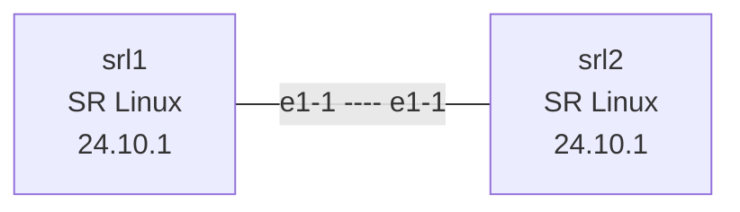

# Lesson 1: Containerlab Primer

Set up containerlab and deploy your first network topology.

## Objectives

By the end of this lesson, you will be able to:

- [ ] Explain what containerlab is and why it matters for DevOps
- [ ] Navigate containerlab documentation and community resources
- [ ] Pull and verify network OS container images
- [ ] Write a containerlab topology file
- [ ] Deploy, inspect, and destroy a network lab
- [ ] Connect to network devices and run basic commands

## Prerequisites

- Completed Lesson 0: Docker Networking Fundamentals
- Containerlab installed ([Linux Setup Guide](../../../docs/getting-started/linux-setup.md))
- Basic YAML knowledge

## Video Outline

### 1. What is Containerlab? (2 min)

**The problem:**
- Testing network changes is risky
- Physical lab equipment is expensive
- VMs are heavy and slow to provision

**The solution:**
- Run network operating systems in containers
- Define topologies in YAML
- Spin up complete networks in seconds

**Why DevOps engineers should care:**
- Test network changes before production
- Understand how your applications traverse the network
- Reproduce network issues locally
- Automate network testing in CI/CD

### 2. Getting Help & Resources (2 min)

**Documentation:** [containerlab.dev](https://containerlab.dev)
- Quick start guides
- Topology reference
- Node-specific documentation

**Community:**
- [Discord](https://discord.gg/vAyddtaEV9) - Ask questions, get help
- [GitHub Discussions](https://github.com/srl-labs/containerlab/discussions)

**Finding examples:**
- [GitHub topic: containerlab](https://github.com/topics/containerlab)
- [Official lab examples](https://github.com/srl-labs/containerlab/tree/main/lab-examples)

### 3. Environment Setup (3 min)

```bash
# Navigate to the lesson
cd lessons/clab/01-containerlab-primer

# Verify containerlab
containerlab version

# Verify Docker
docker version
```

**Pulling the SR Linux image:**

```bash
# Nokia SR Linux (free, no registration required)
docker pull ghcr.io/nokia/srlinux:24.10.1

# Verify
docker images | grep srlinux
```

> **Note:** We use a specific version tag instead of `latest` for reproducibility.

### 4. Understanding Topology Files (4 min)

A topology file defines your network lab:

```yaml
# topology/lab.clab.yml
name: first-lab

topology:
  nodes:
    srl1:
      kind: srl
      image: ghcr.io/nokia/srlinux:24.10.1

    srl2:
      kind: srl
      image: ghcr.io/nokia/srlinux:24.10.1

  links:
    - endpoints: ["srl1:e1-1", "srl2:e1-1"]
```

**Key elements:**
- `name` - Lab identifier (used in container names)
- `topology.nodes` - Network devices to create
- `kind` - Type of device (srl, linux, ceos, etc.)
- `image` - Container image to use
- `topology.links` - Connections between nodes

### 5. Deploying Your First Lab (3 min)

```bash
# Deploy
containerlab deploy -t topology/lab.clab.yml

# What happens:
# 1. Creates Docker network for management
# 2. Starts containers for each node
# 3. Creates virtual links between nodes
# 4. Waits for nodes to be ready
```

**Output explained:**
```
+---+----------------+--------------+-------------------+------+---------+
| # |      Name      | Container ID |       Image       | Kind |  State  |
+---+----------------+--------------+-------------------+------+---------+
| 1 | clab-first-lab-srl1 | abc123  | ghcr.io/nokia/... | srl  | running |
| 2 | clab-first-lab-srl2 | def456  | ghcr.io/nokia/... | srl  | running |
+---+----------------+--------------+-------------------+------+---------+
```

### 6. Working with Your Lab (3 min)

**Inspect running labs:**
```bash
containerlab inspect -t topology/lab.clab.yml
containerlab inspect --all
```

**Connect to a node:**
```bash
# SR Linux CLI
docker exec -it clab-first-lab-srl1 sr_cli

# Inside SR Linux
A:srl1# show version
A:srl1# show interface brief
A:srl1# exit
```

**Generate topology diagram:**
```bash
containerlab graph -t topology/lab.clab.yml
```

### 7. Cleanup (1 min)

```bash
# Destroy the lab
containerlab destroy -t topology/lab.clab.yml

# With config cleanup
containerlab destroy -t topology/lab.clab.yml --cleanup

# Verify
docker ps | grep clab
```

## Lab Topology



## Files in This Lesson

```
01-containerlab-primer/
├── README.md              # This file
├── topology/
│   └── lab.clab.yml       # Main lab topology
├── exercises/
│   └── README.md          # Hands-on exercises
├── solutions/
│   └── README.md          # Exercise solutions
├── tests/
│   └── test_lab.py        # Automated validation
└── script.md              # Video script
```

## Key Commands Reference

| Command | Purpose |
|---------|---------|
| `containerlab deploy -t <file>` | Start the lab |
| `containerlab destroy -t <file>` | Stop and remove the lab |
| `containerlab inspect -t <file>` | Show lab status |
| `containerlab inspect --all` | Show all labs |
| `containerlab graph -t <file>` | Generate topology diagram |
| `docker exec -it <container> sr_cli` | Connect to SR Linux |

## Exercises

Complete the exercises in [exercises/README.md](exercises/README.md).

## Common Issues

**Image pull fails:**
```bash
# Check network connectivity
ping ghcr.io

# Try explicit pull
docker pull ghcr.io/nokia/srlinux:24.10.1
```

**Lab won't deploy:**
```bash
# Check Docker is running
docker ps

# Check for syntax errors
containerlab deploy -t topology/lab.clab.yml --debug
```

**Can't connect to node:**
```bash
# Verify container is running
docker ps | grep clab

# Check container logs
docker logs clab-first-lab-srl1
```

**Interfaces show "down" after deploy:**

SR Linux takes 15-30 seconds to fully boot. Wait and re-check:
```bash
# Wait, then verify
sleep 20
docker exec -it clab-first-lab-srl1 sr_cli -c "show interface brief"
```

## What's Next

In [Lesson 2: IP Fundamentals](../02-ip-fundamentals/), you'll configure IP addresses on these devices and establish connectivity.

## Additional Resources

- [Containerlab Quick Start](https://containerlab.dev/quickstart/)
- [SR Linux Container](https://github.com/nokia/srlinux-container-image)
- [Topology File Reference](https://containerlab.dev/manual/topo-def-file/)
