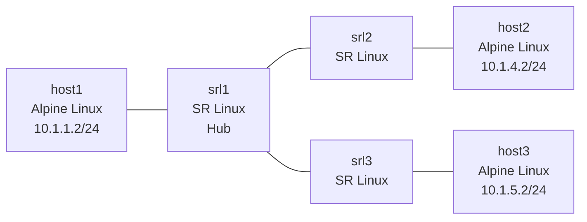

# Lesson 3: Routing Basics & Static Routes

Configure static routes on a hub-and-spoke topology and trace packets hop by hop using Ansible automation.

## Objectives

By the end of this lesson, you will be able to:

- [ ] Explain what a routing table contains and how routers make forwarding decisions (longest prefix match)
- [ ] Distinguish between directly connected routes and static routes
- [ ] Configure static routes on SR Linux using next-hop-groups
- [ ] Use Ansible with Jinja2 templates to automate both interface and route configuration
- [ ] Trace a packet's path through multiple routers and explain why the return path matters
- [ ] Diagnose routing failures: missing routes, wrong next-hops, routing loops, and unreachable next-hops

## Prerequisites

- Completed Lesson 0: Docker Networking Fundamentals
- Completed Lesson 1: Containerlab Primer
- Completed Lesson 2: IP Fundamentals
- Ansible installed (`ansible --version`)

## Video Outline

### 1. Routing Table Fundamentals (3 min)

Every router maintains a routing table -- a list of known destinations and where to send packets for each one. In Lesson 2, routers only knew about their directly connected subnets. That's why cross-subnet pings failed.

| Route Type | How It Gets There | Example |
|------------|-------------------|---------|
| Directly connected | Auto-created when you configure an interface IP | `10.1.1.0/24` on srl1 (interface e1-1) |
| Static | Manually configured by an administrator | `10.1.4.0/24` via `10.1.2.2` |
| Default | Catch-all for anything not in the table | `0.0.0.0/0` via gateway |

**Longest prefix match:** When multiple routes match a destination, the router picks the most specific one. A `/24` beats a `/16`, which beats the default `/0`. This is how routers make forwarding decisions.

**Default gateways revisited:** In Lesson 2, hosts had default gateways to reach the router. Routers need routing entries too -- they won't forward packets to subnets they don't know about.

### 2. Static Routes on SR Linux (2 min)

SR Linux requires a **next-hop-group** for each static route. This is a two-step process: create the group with the next-hop IP, then create the route pointing to that group.

```bash
# Create a next-hop-group
set / network-instance default next-hop-groups group nhg-10-1-4-0-24 admin-state enable
set / network-instance default next-hop-groups group nhg-10-1-4-0-24 nexthop 1 ip-address 10.1.2.2

# Create the static route pointing to the group
set / network-instance default static-routes route 10.1.4.0/24 admin-state enable
set / network-instance default static-routes route 10.1.4.0/24 next-hop-group nhg-10-1-4-0-24
```

**When to use static routes:** Small networks, stub networks (single exit point), and default routes. They're simple and predictable, but they don't adapt to failures.

### 3. Extending Ansible with Routes (3 min)

In Lesson 2, Ansible pushed interface configs. Now we add a second template for routes.

**New routes template** (`srl_routes.json.j2`) -- auto-generates next-hop-group names from the prefix:

```jinja2


...

```

**Host vars** get a `static_routes` section alongside `interfaces`:

```yaml
# ansible/host_vars/srl1.yml (excerpt)
static_routes:
  - prefix: 10.1.4.0/24
    next_hop: 10.1.2.2
  - prefix: 10.1.5.0/24
    next_hop: 10.1.3.2
```

**Playbook** gets a second task applying routes after interfaces. The template is the same for every router. Only the variables change.

### 4. Live Demo -- Deploy and Configure (3 min)

```bash
# Navigate to lesson directory
cd lessons/clab/03-routing-basics

# Deploy the 6-node hub-and-spoke topology
containerlab deploy -t topology/lab.clab.yml

# Run Ansible to configure interfaces and routes
cd ansible
ansible-playbook -i inventory.yml playbook.yml
```

Ansible renders the Jinja2 templates for each router using its host_vars, then pushes the CLI commands to SR Linux via the JSON-RPC API. The playbook applies interfaces first, then routes.

Verify all pings work:

```bash
docker exec clab-routing-basics-host1 ping -c 3 10.1.4.2  # host1 -> host2
docker exec clab-routing-basics-host1 ping -c 3 10.1.5.2  # host1 -> host3
docker exec clab-routing-basics-host2 ping -c 3 10.1.5.2  # host2 -> host3
```

### 5. Multi-Hop Packet Trace (2 min)

Trace host2 (`10.1.4.2`) to host3 (`10.1.5.2`) through the hub:

1. host2 sends to default gateway `10.1.4.1` (srl2)
2. srl2 looks up `10.1.5.0/24` -> next-hop `10.1.2.1` (srl1)
3. srl1 looks up `10.1.5.0/24` -> next-hop `10.1.3.2` (srl3)
4. srl3 has `10.1.5.0/24` directly connected -> delivers to host3

**Return path matters:** host3 sends the reply back through the same chain in reverse. If any router along the return path is missing a route, the reply gets dropped and the ping "fails" even though the request arrived.

### 6. Recap + Teaser (30 sec)

Static routes work for small topologies. But what happens when you have 50 routers? Or 500? You can't manually configure every route. Lesson 4 introduces dynamic routing with BGP.

## Lab Topology



## IP Addressing

| Subnet | Link | Left Device | Right Device |
|--------|------|-------------|--------------|
| `10.1.1.0/24` | host1 -- srl1 | host1: `eth1` = `10.1.1.2` | srl1: `e1-1` = `10.1.1.1` |
| `10.1.2.0/24` | srl1 -- srl2 | srl1: `e1-2` = `10.1.2.1` | srl2: `e1-1` = `10.1.2.2` |
| `10.1.3.0/24` | srl1 -- srl3 | srl1: `e1-3` = `10.1.3.1` | srl3: `e1-1` = `10.1.3.2` |
| `10.1.4.0/24` | srl2 -- host2 | srl2: `e1-2` = `10.1.4.1` | host2: `eth1` = `10.1.4.2` |
| `10.1.5.0/24` | srl3 -- host3 | srl3: `e1-2` = `10.1.5.1` | host3: `eth1` = `10.1.5.2` |

Convention: routers get `.1`, hosts get `.2`.

## Static Routes

| Router | Destination | Next-Hop | Purpose |
|--------|------------|----------|---------|
| srl1 (hub) | `10.1.4.0/24` | `10.1.2.2` (srl2) | host2 subnet via srl2 |
| srl1 (hub) | `10.1.5.0/24` | `10.1.3.2` (srl3) | host3 subnet via srl3 |
| srl2 (spoke) | `10.1.1.0/24` | `10.1.2.1` (srl1) | host1 subnet via hub |
| srl2 (spoke) | `10.1.3.0/24` | `10.1.2.1` (srl1) | srl1-srl3 link via hub |
| srl2 (spoke) | `10.1.5.0/24` | `10.1.2.1` (srl1) | host3 subnet via hub |
| srl3 (spoke) | `10.1.1.0/24` | `10.1.3.1` (srl1) | host1 subnet via hub |
| srl3 (spoke) | `10.1.2.0/24` | `10.1.3.1` (srl1) | srl1-srl2 link via hub |
| srl3 (spoke) | `10.1.4.0/24` | `10.1.3.1` (srl1) | host2 subnet via hub |

## Files in This Lesson

```
03-routing-basics/
├── README.md              # This file
├── topology/
│   └── lab.clab.yml       # 6-node hub-and-spoke topology
├── ansible/
│   ├── inventory.yml      # Router inventory (3 routers)
│   ├── playbook.yml       # Configuration playbook
│   ├── templates/
│   │   ├── srl_interfaces.json.j2  # Interface config template
│   │   └── srl_routes.json.j2      # Static route config template
│   └── host_vars/
│       ├── srl1.yml       # srl1: 3 interfaces, 2 static routes
│       ├── srl2.yml       # srl2: 2 interfaces, 3 static routes
│       └── srl3.yml       # srl3: 2 interfaces, 3 static routes
├── exercises/
│   └── README.md          # Hands-on exercises (6 total, 4 break/fix)
├── solutions/
│   └── README.md          # Exercise solutions
├── tests/
│   └── test_routing_basics.py  # Automated validation
└── script.md              # Video script
```

## Key Commands Reference

| Command | Purpose |
|---------|---------|
| `containerlab deploy -t topology/lab.clab.yml` | Deploy the lab |
| `containerlab destroy -t topology/lab.clab.yml --cleanup` | Destroy the lab |
| `cd ansible && ansible-playbook -i inventory.yml playbook.yml` | Apply router configs |
| `docker exec clab-routing-basics-host1 ping -c 3 <ip>` | Ping from host1 |
| `docker exec -it clab-routing-basics-srl1 sr_cli` | Connect to srl1 CLI |
| `show interface brief` | SR Linux: interface summary |
| `show network-instance default route-table ipv4-unicast summary` | SR Linux: routing table |
| `show arpnd arp-entries` | SR Linux: ARP table |
| `traceroute <ip>` | Trace packet path (from hosts) |

## Exercises

Complete the exercises in [exercises/README.md](exercises/README.md).

## Common Issues

**Ansible playbook fails to connect:**
```bash
# Verify the lab is running
containerlab inspect -t topology/lab.clab.yml

# Check management IP is reachable
ping -c 1 172.20.20.11

# Verify JSON-RPC is responding
curl -s http://172.20.20.11/jsonrpc -d '{"jsonrpc":"2.0","id":1,"method":"get","params":{"commands":[{"path":"/system/name","datastore":"state"}]}}' -u admin:NokiaSrl1!
```

**Ping works to directly connected devices but fails across subnets:**
```bash
# Check routing table on the router
docker exec -it clab-routing-basics-srl1 sr_cli -c "show network-instance default route-table ipv4-unicast summary"

# Look for missing static routes -- this is the lesson 02 problem that lesson 03 solves
```

**Static routes applied but ping still fails:**
```bash
# Check BOTH directions -- the return path matters
# Verify the destination router has a route back to the source
docker exec -it clab-routing-basics-srl2 sr_cli -c "show network-instance default route-table ipv4-unicast summary"
```

**Lab won't deploy:**
```bash
# Check Docker is running
docker ps

# Look for port or name conflicts with existing labs
containerlab inspect --all

# Try with debug output
containerlab deploy -t topology/lab.clab.yml --debug
```

## Navigation

Previous: [Lesson 2: IP Fundamentals](../02-ip-fundamentals/) | [Course Index](../README.md) | Next: Lesson 4 (coming soon)

## Additional Resources

- [SR Linux Static Routes](https://documentation.nokia.com/srlinux/)
- [Ansible Getting Started](https://docs.ansible.com/ansible/latest/getting_started/)
- [Jinja2 Template Designer](https://jinja.palletsprojects.com/en/3.1.x/templates/)
- [Containerlab Topology Reference](https://containerlab.dev/manual/topo-def-file/)
- [Longest Prefix Match Explained](https://en.wikipedia.org/wiki/Longest_prefix_match)
