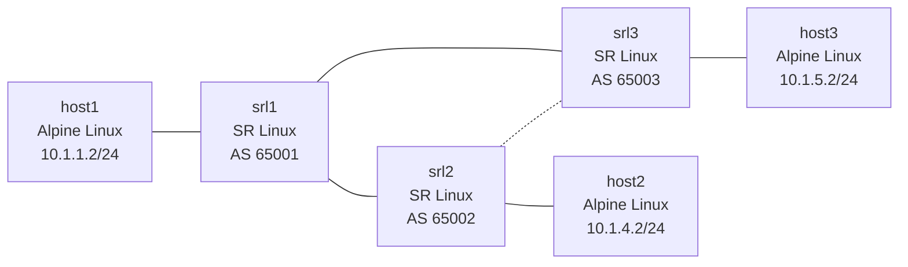

# Lesson 4: Dynamic Routing with BGP

Replace static routes with eBGP on an evolving hub-and-spoke topology and introduce gNMIc for model-driven network automation.

## Objectives

By the end of this lesson, you will be able to:

- [ ] Explain why dynamic routing exists and what problems it solves over static routes
- [ ] Configure eBGP peering on SR Linux with peer-groups and export policies
- [ ] Use gNMIc to configure network devices via gNMI (model-driven, gRPC-based)
- [ ] Observe BGP path selection when a new link provides a shorter AS path
- [ ] Diagnose BGP failures: missing export policy, wrong ASN, session states
- [ ] Explain how BGP relates to Kubernetes networking (Calico, MetalLB)

## Prerequisites

- Completed Lesson 0: Docker Networking Fundamentals
- Completed Lesson 1: Containerlab Primer
- Completed Lesson 2: IP Fundamentals
- Completed Lesson 3: Routing Basics & Static Routes
- gNMIc installed (`gnmic version`) -- install with `brew install gnmic`

## Video Outline

### 1. Why Dynamic Routing? (2 min)

In Lesson 3, we configured static routes on every router by hand. That works for three routers, but it doesn't scale. Add a fourth router and you're updating routes on every existing device. Remove a link and traffic blackholes until someone notices and fixes the config.

Dynamic routing protocols solve this by having routers exchange route information automatically. When a link goes down, routers detect the failure and recalculate paths without human intervention.

| Approach | Scales? | Adapts to Failures? | Complexity |
|----------|---------|---------------------|------------|
| Static routes | No -- O(n^2) manual entries | No -- blackholes until fixed | Low |
| Dynamic routing (BGP) | Yes -- routers learn automatically | Yes -- converges in seconds | Medium |

### 2. BGP Fundamentals (3 min)

BGP (Border Gateway Protocol) is the routing protocol that runs the internet. In data centers, it's also the protocol of choice for leaf-spine fabrics and Kubernetes networking.

**Autonomous Systems (AS):** Each router (or group of routers) gets an AS number. When routers in different ASes peer, that's eBGP (external BGP).

**Session States:** BGP peers go through a state machine before exchanging routes:

| State | Meaning |
|-------|---------|
| Idle | Not trying to connect |
| Connect | TCP connection in progress |
| OpenSent | TCP connected, OPEN message sent |
| OpenConfirm | OPEN received, waiting for KEEPALIVE |
| Established | Peers are up, exchanging routes |

**Routing Policies (SR Linux default-deny):** SR Linux does not accept or advertise any BGP routes by default. You must create explicit policies:

- **Import policy:** Controls which received routes are accepted into the routing table. Without one, received routes are rejected.
- **Export policy:** Controls which routes are advertised to peers. Without one, no routes are shared.

In this lab, we use three policies chained together:

| Policy | Purpose | Default Action |
|--------|---------|----------------|
| `import-all` | Accept all received routes | accept |
| `export-connected` | Advertise directly connected subnets | next-policy |
| `export-bgp` | Re-advertise BGP-learned routes | reject |

**Policy chaining:** When a peer-group has multiple export policies (`[export-connected, export-bgp]`), SR Linux evaluates them in order. If a route matches a statement with `accept`, it's advertised. If it doesn't match any statement and the default-action is `next-policy`, it passes to the next policy in the chain. If the default-action is `reject`, the route is dropped. This lets you build modular, composable policies instead of one monolithic rule set.

### BGP Best Path Algorithm

When a router receives the same prefix from multiple peers, BGP uses a decision process to select the best path. The simplified algorithm (in order of priority):

| Step | Attribute | Rule | In This Lab |
|------|-----------|------|-------------|
| 1 | Local Preference | Highest wins | Not set (default 100) |
| 2 | AS Path Length | Shortest wins | Exercise 2 demonstrates this |
| 3 | Origin | IGP (i) > EGP (e) > incomplete (?) | All routes are IGP |
| 4 | MED | Lowest wins (from same neighbor AS) | Not set |
| 5 | eBGP vs iBGP | eBGP preferred | All peers are eBGP |
| 6 | Router ID | Lowest wins (tiebreaker) | Only used if everything else ties |

In Exercise 2, when srl2 receives 10.1.5.0/24 from both srl1 (AS path: [65001, 65003]) and srl3 (AS path: [65003]), steps 1, 3, 4, and 5 are equal. Step 2 breaks the tie -- the direct path through srl3 has a shorter AS path (1 hop vs 2 hops), so BGP selects it automatically.

You can see these attributes in the output of `show network-instance default protocols bgp routes ipv4 prefix <prefix> detail`. The `MED is -, No LocalPref` line means those attributes are at their defaults and not influencing the decision.

### 3. Introducing gNMIc (2 min)

In Lessons 2-3, we used Ansible with JSON-RPC to configure routers. gNMIc takes a different approach: it speaks gNMI (gRPC Network Management Interface), a model-driven protocol based on YANG data models.

| | Ansible + JSON-RPC | gNMIc + gNMI |
|---|---|---|
| Transport | HTTP/JSON | gRPC/Protobuf |
| Data model | CLI commands as strings | Structured YANG paths |
| Operations | get, set (CLI-wrapped) | get, set, subscribe |
| Streaming telemetry | No | Yes (subscribe) |
| Best for | Multi-vendor orchestration | Model-driven config, monitoring |

**YANG paths** address specific config elements like a filesystem path:

```
/interface[name=ethernet-1/1]/subinterface[index=0]/ipv4/admin-state
```

gNMIc uses `set --request-file` to push JSON payloads targeting these paths. The payloads in `gnmic/configs/` contain the exact BGP configuration for each router.

### 4. Live Demo -- Static to Dynamic (3 min)

```bash
# Navigate to lesson directory
cd lessons/clab/04-dynamic-routing-bgp

# Deploy the topology (interfaces pre-configured via startup configs)
containerlab deploy -t topology/lab.clab.yml

# Apply BGP configuration to all three routers via gNMIc
gnmic -a clab-dynamic-routing-bgp-srl1:57400 -u admin -p NokiaSrl1! --skip-verify -e json_ietf set --request-file gnmic/configs/srl1-bgp.json
gnmic -a clab-dynamic-routing-bgp-srl2:57400 -u admin -p NokiaSrl1! --skip-verify -e json_ietf set --request-file gnmic/configs/srl2-bgp.json
gnmic -a clab-dynamic-routing-bgp-srl3:57400 -u admin -p NokiaSrl1! --skip-verify -e json_ietf set --request-file gnmic/configs/srl3-bgp.json
```

Verify BGP sessions are Established:

```bash
docker exec -it clab-dynamic-routing-bgp-srl1 sr_cli -c "show network-instance default protocols bgp neighbor"
```

Verify end-to-end connectivity:

```bash
docker exec clab-dynamic-routing-bgp-host1 ping -c 3 10.1.4.2  # host1 -> host2
docker exec clab-dynamic-routing-bgp-host1 ping -c 3 10.1.5.2  # host1 -> host3
docker exec clab-dynamic-routing-bgp-host2 ping -c 3 10.1.5.2  # host2 -> host3
```

### 5. Live Demo -- New Link and Path Selection (2 min)

Traffic between host2 and host3 currently takes the long path through the hub (srl2 -> srl1 -> srl3). The srl2-srl3 link is physically wired but unconfigured.

```bash
# Configure the new srl2-srl3 link
gnmic -a clab-dynamic-routing-bgp-srl2:57400 -u admin -p NokiaSrl1! --skip-verify -e json_ietf set --request-file gnmic/configs/srl2-new-link.json
gnmic -a clab-dynamic-routing-bgp-srl3:57400 -u admin -p NokiaSrl1! --skip-verify -e json_ietf set --request-file gnmic/configs/srl3-new-link.json

# Add BGP peering between srl2 and srl3
gnmic -a clab-dynamic-routing-bgp-srl2:57400 -u admin -p NokiaSrl1! --skip-verify -e json_ietf set --request-file gnmic/configs/srl2-bgp-srl3.json
gnmic -a clab-dynamic-routing-bgp-srl3:57400 -u admin -p NokiaSrl1! --skip-verify -e json_ietf set --request-file gnmic/configs/srl3-bgp-srl2.json
```

Now traceroute shows the direct path:

```bash
# Before: host2 -> srl2 -> srl1 -> srl3 -> host3 (3 hops)
# After:  host2 -> srl2 -> srl3 -> host3 (2 hops)
docker exec clab-dynamic-routing-bgp-host2 traceroute 10.1.5.2
```

BGP prefers the shorter AS path (1 AS hop via srl3 directly vs. 2 AS hops via srl1 then srl3). This is automatic -- no manual route changes needed.

### 6. Recap + Teaser (30 sec)

BGP replaced all our static routes and automatically adapted when we added a new link. Next lesson: scale to a 2-spine 4-leaf data center fabric.

## Lab Topology



The dashed line between srl2 and srl3 indicates a link that is pre-wired but unconfigured at deploy time. Exercise 3 enables it.

## IP Addressing

| Subnet | Link | Left Device | Right Device |
|--------|------|-------------|--------------|
| `10.1.1.0/24` | host1 -- srl1 | host1: `eth1` = `10.1.1.2` | srl1: `e1-1` = `10.1.1.1` |
| `10.1.2.0/24` | srl1 -- srl2 | srl1: `e1-2` = `10.1.2.1` | srl2: `e1-1` = `10.1.2.2` |
| `10.1.3.0/24` | srl1 -- srl3 | srl1: `e1-3` = `10.1.3.1` | srl3: `e1-1` = `10.1.3.2` |
| `10.1.4.0/24` | srl2 -- host2 | srl2: `e1-2` = `10.1.4.1` | host2: `eth1` = `10.1.4.2` |
| `10.1.5.0/24` | srl3 -- host3 | srl3: `e1-2` = `10.1.5.1` | host3: `eth1` = `10.1.5.2` |
| `10.1.6.0/24` | srl2 -- srl3 (new) | srl2: `e1-3` = `10.1.6.1` | srl3: `e1-3` = `10.1.6.2` |

Convention: routers get `.1`, hosts get `.2`.

## BGP Design

| Router | ASN | Router-ID | Neighbors |
|--------|-----|-----------|-----------|
| srl1 (hub) | 65001 | 10.0.0.1 | srl2 (`10.1.2.2`, AS 65002), srl3 (`10.1.3.2`, AS 65003) |
| srl2 (spoke) | 65002 | 10.0.0.2 | srl1 (`10.1.2.1`, AS 65001), srl3 (`10.1.6.2`, AS 65003, after exercise 3) |
| srl3 (spoke) | 65003 | 10.0.0.3 | srl1 (`10.1.3.1`, AS 65001), srl2 (`10.1.6.1`, AS 65002, after exercise 3) |

All routers use export policy `export-connected` (matches protocol local, accepts).

## Why This Matters for Kubernetes

| BGP Concept | Kubernetes Equivalent |
|---|---|
| BGP peering between routers | Calico node-to-node mesh or route reflector |
| Advertising a prefix | Node advertising its pod CIDR |
| Withdrawing a route on failure | Node failure causing pod CIDR withdrawal |
| Convergence time | Time for traffic to reroute after node failure |
| Export policy | Calico BGP configuration controlling route advertisement |

If you run Kubernetes with Calico CNI, every node is a BGP speaker advertising its pod CIDR to its peers -- exactly what srl1/srl2/srl3 do in this lab. MetalLB in BGP mode advertises Service VIPs the same way. The concepts you learn here are directly applicable to understanding and troubleshooting Kubernetes networking.

## Files in This Lesson

```
04-dynamic-routing-bgp/
├── README.md              # This file
├── topology/
│   ├── lab.clab.yml       # 6-node hub-and-spoke topology
│   └── configs/
│       ├── srl1-base.cli  # srl1 startup config (interfaces)
│       ├── srl2-base.cli  # srl2 startup config (interfaces)
│       └── srl3-base.cli  # srl3 startup config (interfaces)
├── gnmic/
│   ├── .gnmic.yml         # gNMIc global settings
│   └── configs/
│       ├── srl1-bgp.json       # srl1 BGP config
│       ├── srl2-bgp.json       # srl2 BGP config
│       ├── srl3-bgp.json       # srl3 BGP config
│       ├── srl2-new-link.json  # srl2 e1-3 interface config
│       ├── srl3-new-link.json  # srl3 e1-3 interface config
│       ├── srl2-bgp-srl3.json  # srl2 BGP neighbor for srl3
│       └── srl3-bgp-srl2.json  # srl3 BGP neighbor for srl2
├── exercises/
│   └── README.md          # Hands-on exercises
├── solutions/
│   └── README.md          # Exercise solutions
├── tests/
│   ├── README.md          # Test documentation
│   └── test_dynamic_routing.py  # Automated validation
└── script.md              # Video script
```

## Key Commands Reference

| Command | Purpose |
|---------|---------|
| `containerlab deploy -t topology/lab.clab.yml` | Deploy the lab |
| `containerlab destroy -t topology/lab.clab.yml --cleanup` | Destroy the lab |
| `gnmic -a HOST:57400 -u admin -p NokiaSrl1! --skip-verify -e json_ietf set --request-file FILE` | Apply config via gNMIc |
| `gnmic -a HOST:57400 -u admin -p NokiaSrl1! --skip-verify -e json_ietf get --path PATH --type state` | Read state via gNMIc |
| `gnmic -a HOST:57400 -u admin -p NokiaSrl1! --skip-verify -e json_ietf set --delete PATH` | Delete config via gNMIc |
| `docker exec -it clab-dynamic-routing-bgp-srl1 sr_cli` | Connect to srl1 CLI |
| `show network-instance default protocols bgp neighbor` | SR Linux: BGP neighbor summary |
| `show network-instance default protocols bgp neighbor X detail` | SR Linux: BGP neighbor detail |
| `show network-instance default route-table ipv4-unicast summary` | SR Linux: routing table |

## Exercises

Complete the exercises in [exercises/README.md](exercises/README.md).

## Common Issues

**BGP session is Established but no routes:**
```bash
# This is the most common SR Linux BGP issue -- default-deny export policy
# Verify the export policy exists and is applied to the peer-group
docker exec -it clab-dynamic-routing-bgp-srl1 sr_cli -c "show network-instance default protocols bgp neighbor"

# Check if routes are being advertised
docker exec -it clab-dynamic-routing-bgp-srl1 sr_cli -c "show network-instance default protocols bgp neighbor 10.1.2.2 advertised-routes ipv4"
```

**BGP session stuck in Active/Connect:**
```bash
# Check that peer-as matches on both sides
docker exec -it clab-dynamic-routing-bgp-srl1 sr_cli -c "info network-instance default protocols bgp neighbor 10.1.2.2"
docker exec -it clab-dynamic-routing-bgp-srl2 sr_cli -c "info network-instance default protocols bgp neighbor 10.1.2.1"

# Verify interface IPs are correct and reachable
docker exec -it clab-dynamic-routing-bgp-srl1 sr_cli -c "show interface ethernet-1/2 brief"
docker exec clab-dynamic-routing-bgp-srl1 ip addr show ethernet-1/2.0
```

**Static routes still winning over BGP:**
```bash
# Static routes have lower admin distance (5) than BGP (170) on SR Linux
# Remove static routes before relying on BGP
docker exec -it clab-dynamic-routing-bgp-srl1 sr_cli -c "show network-instance default route-table ipv4-unicast summary"
```

**Lab won't deploy:**
```bash
# Check Docker is running
docker ps

# Look for port or name conflicts with existing labs
containerlab inspect --all

# Try with debug output
containerlab deploy -t topology/lab.clab.yml --debug
```

## Navigation

Previous: [Lesson 3: Routing Basics & Static Routes](../03-routing-basics/) | [Course Index](../README.md) | Next: [Lesson 5: Spine-Leaf Networking with BGP](../05-spine-leaf-bgp/)

## Additional Resources

- [SR Linux BGP Configuration](https://documentation.nokia.com/srlinux/)
- [gNMIc Documentation](https://gnmic.openconfig.net/)
- [RFC 4271 - BGP-4](https://datatracker.ietf.org/doc/html/rfc4271)
- [RFC 7938 - Use of BGP in Large-Scale Data Centers](https://datatracker.ietf.org/doc/html/rfc7938)
- [Containerlab Topology Reference](https://containerlab.dev/manual/topo-def-file/)
