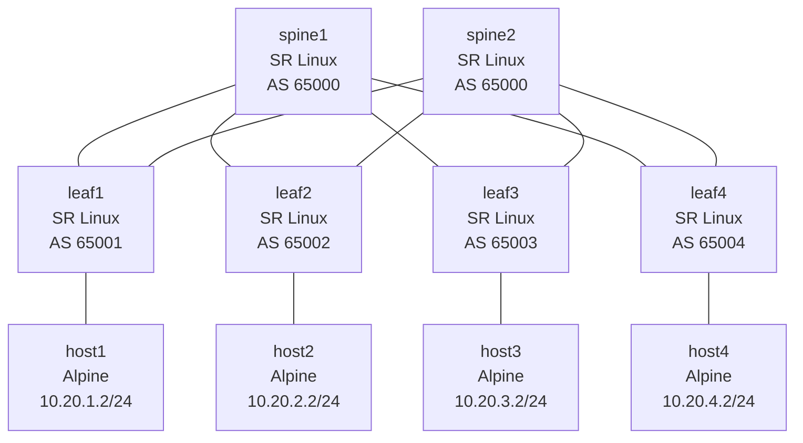

# Lesson 5: Spine-Leaf Networking with BGP

Deploy a Clos spine-leaf fabric with eBGP underlay, observe ECMP across spines, and test fabric resilience.

## Objectives

By the end of this lesson, you will be able to:

- [ ] Explain Clos/spine-leaf architecture and why it replaced full mesh and 3-tier designs in data centers
- [ ] Deploy a multi-tier fabric topology with containerlab
- [ ] Configure eBGP underlay using RFC 7938 (shared spine ASN, unique leaf ASNs)
- [ ] Use gNMIc to configure and verify BGP across a 6-router fabric
- [ ] Observe ECMP (equal-cost multipath) across spines
- [ ] Diagnose fabric failures: spine loss, ECMP path changes

## Prerequisites

- Completed Lesson 0: Docker Networking Fundamentals
- Completed Lesson 1: Containerlab Primer
- Completed Lesson 2: IP Fundamentals
- Completed Lesson 3: Routing Basics & Static Routes
- Completed Lesson 4: Dynamic Routing with BGP
- gNMIc installed (`gnmic version`) -- install with `brew install gnmic`
- Minimum 16 GB RAM recommended (10 containers)

## Video Outline

### 1. Why Spine-Leaf? (2 min)

In Lesson 4, we started with hub-and-spoke routing and then Exercise 3 pushed it to a full mesh of 3 routers -- every router peered with every other. Full mesh gives you redundancy, but it doesn't scale. As you add routers the number of links explodes, and managing a full mesh of 20 or 30 devices becomes unworkable.

The real predecessor in data centers was the 3-tier model: core, distribution, and access layers. That solved the physical scale problem but introduced Spanning Tree Protocol to prevent loops -- and STP works by blocking redundant links. You pay for the redundancy and then deliberately disable it.

Clos spine-leaf architecture, based on Charles Clos's 1953 telephone switching paper, solves both problems. Every link is active. Traffic is load-balanced across all spines via ECMP. And the tiers scale independently -- add more leaves without touching the spines, or add more spines to increase cross-fabric bandwidth.

| Approach | Bottleneck? | Redundancy | Scaling |
|----------|-------------|------------|---------|
| 3-tier (core/dist/access) | Yes -- spanning tree blocks links | Active/standby paths | Complex, wasteful |
| Clos spine-leaf | No -- all paths active (ECMP) | Any spine can fail | Add spines or leaves independently |

### 2. BGP Design Choices (2 min)

With the topology decided, we need a routing protocol. BGP is the standard choice for data center fabrics, but there's a design question: iBGP or eBGP?

iBGP (interior BGP, same AS everywhere) has a catch -- a router won't re-advertise a route it learned via iBGP to another iBGP peer. You can work around this with route reflectors, but that adds complexity and creates scaling bottlenecks.

eBGP avoids the problem entirely. When every link is an eBGP session between different autonomous systems, every router re-advertises routes naturally. No route reflectors needed.

RFCs are the primary source of truth for internet protocols -- they're the formal specifications that vendors implement. RFC 7938, published in 2016, documents how large-scale data centers use BGP. Its key recommendation: eBGP-only, with a shared ASN for all spine devices and a unique ASN per leaf.

Why shared spine ASN? AS-path loop prevention. If a leaf advertises a prefix up to spine1, spine1 advertises it to other leaves. Those leaves advertise it back up -- but spine2 sees the leaf's ASN already in the path and rejects it. This prevents routing loops without any additional configuration, and the shared spine ASN means leaves see equal-cost paths through both spines and ECMP kicks in automatically.

### 3. Our Fabric (2 min)

In a Clos fabric, every leaf connects to every spine. There are no leaf-to-leaf or spine-to-spine links. This creates a predictable, non-oversubscribed network where every leaf-to-leaf path crosses exactly one spine.

Key design principles:

- **/31 point-to-point links** between each spine-leaf pair (no wasted IPs)
- **RFC 7938 eBGP with shared spine ASN** -- both spines share AS 65000, leaves get unique ASNs 65001-65004
- **peer-group** configuration groups neighbors with common policy (all leaves on a spine share one peer-group, all spines on a leaf share another)
- **router-ID** is a unique loopback-style address per device (10.0.1.x for spines, 10.0.2.x for leaves)
- **No oversubscription between tiers** -- aggregate leaf uplink bandwidth equals spine capacity
- **ECMP across spines** -- traffic between any two leaves is load-balanced across all available spines

### 4. Deploying the Fabric (2 min)

```bash
# Navigate to lesson directory
cd lessons/clab/05-spine-leaf-bgp

# Deploy the topology (interfaces pre-configured via startup configs)
containerlab deploy -t topology/lab.clab.yml
```

Startup configs in `topology/configs/` handle base interface IP addressing. gNMIc then applies BGP configuration from `gnmic/configs/`.

### 5. Live Demo: Configure and Verify (3 min)

```bash
# Apply BGP configuration to all 6 routers via gNMIc
# Run from the gnmic/ directory so .gnmic.yml provides credentials, encoding, and skip-verify
cd gnmic
gnmic -a clab-spine-leaf-bgp-spine1:57400 set --request-file configs/spine1-bgp.json
gnmic -a clab-spine-leaf-bgp-spine2:57400 set --request-file configs/spine2-bgp.json
gnmic -a clab-spine-leaf-bgp-leaf1:57400 set --request-file configs/leaf1-bgp.json
gnmic -a clab-spine-leaf-bgp-leaf2:57400 set --request-file configs/leaf2-bgp.json
gnmic -a clab-spine-leaf-bgp-leaf3:57400 set --request-file configs/leaf3-bgp.json
gnmic -a clab-spine-leaf-bgp-leaf4:57400 set --request-file configs/leaf4-bgp.json
```

Verify all 8 BGP sessions are Established:

```bash
docker exec -it clab-spine-leaf-bgp-spine1 sr_cli -c "show network-instance default protocols bgp neighbor"
docker exec -it clab-spine-leaf-bgp-spine2 sr_cli -c "show network-instance default protocols bgp neighbor"
```

Verify ECMP in the routing table -- each leaf should show two equal-cost paths (one via each spine) to every remote host subnet:

```bash
docker exec -it clab-spine-leaf-bgp-leaf1 sr_cli -c "show network-instance default route-table ipv4-unicast summary"
```

Verify end-to-end connectivity:

```bash
docker exec clab-spine-leaf-bgp-host1 ping -c 3 10.20.2.2  # host1 -> host2
docker exec clab-spine-leaf-bgp-host1 ping -c 3 10.20.3.2  # host1 -> host3
docker exec clab-spine-leaf-bgp-host1 ping -c 3 10.20.4.2  # host1 -> host4
```

### 6. Live Demo: Spine Failure and Recovery (2 min)

```bash
# Disable all spine1 interfaces toward leaves -- traffic redistributes through spine2
docker exec -it clab-spine-leaf-bgp-spine1 sr_cli
# enter candidate
# set / interface ethernet-1/1 admin-state disable
# set / interface ethernet-1/2 admin-state disable
# set / interface ethernet-1/3 admin-state disable
# set / interface ethernet-1/4 admin-state disable
# commit now

# Verify connectivity still works (single path through spine2)
docker exec clab-spine-leaf-bgp-host1 ping -c 3 10.20.2.2

# Check routing table -- only one path per destination now
docker exec -it clab-spine-leaf-bgp-leaf1 sr_cli -c "show network-instance default route-table ipv4-unicast summary"

# Re-enable spine1 interfaces -- ECMP restores
docker exec -it clab-spine-leaf-bgp-spine1 sr_cli
# set / interface ethernet-1/1 admin-state enable
# set / interface ethernet-1/2 admin-state enable
# set / interface ethernet-1/3 admin-state enable
# set / interface ethernet-1/4 admin-state enable
# commit now

# Verify ECMP is restored (two paths per destination)
docker exec -it clab-spine-leaf-bgp-leaf1 sr_cli -c "show network-instance default route-table ipv4-unicast summary"
```

### Recap + Teaser (30 sec)

Pure L3 gets packets between racks. But what about VMs or containers on the same subnet across racks? EVPN/VXLAN -- coming next.

## Lab Topology

> **Note:** This lab runs 10 containers (6 SR Linux + 4 Alpine). Minimum 16 GB RAM recommended.



## IP Addressing

### Spine-Leaf Links (/31 point-to-point)

| Link | Subnet | Spine IP | Leaf IP |
|------|--------|----------|---------|
| spine1 -- leaf1 | `10.10.1.0/31` | `10.10.1.0` | `10.10.1.1` |
| spine1 -- leaf2 | `10.10.1.2/31` | `10.10.1.2` | `10.10.1.3` |
| spine1 -- leaf3 | `10.10.1.4/31` | `10.10.1.4` | `10.10.1.5` |
| spine1 -- leaf4 | `10.10.1.6/31` | `10.10.1.6` | `10.10.1.7` |
| spine2 -- leaf1 | `10.10.2.0/31` | `10.10.2.0` | `10.10.2.1` |
| spine2 -- leaf2 | `10.10.2.2/31` | `10.10.2.2` | `10.10.2.3` |
| spine2 -- leaf3 | `10.10.2.4/31` | `10.10.2.4` | `10.10.2.5` |
| spine2 -- leaf4 | `10.10.2.6/31` | `10.10.2.6` | `10.10.2.7` |

### Host Subnets

| Leaf | Host Subnet | Leaf IP | Host IP |
|------|-------------|---------|---------|
| leaf1 | `10.20.1.0/24` | `10.20.1.1` | `10.20.1.2` |
| leaf2 | `10.20.2.0/24` | `10.20.2.1` | `10.20.2.2` |
| leaf3 | `10.20.3.0/24` | `10.20.3.1` | `10.20.3.2` |
| leaf4 | `10.20.4.0/24` | `10.20.4.1` | `10.20.4.2` |

Convention: routers get `.1`, hosts get `.2`.

## BGP Design

| Device | ASN | Router-ID | Peer Group | Neighbors |
|--------|-----|-----------|------------|-----------|
| spine1 | 65000 | 10.0.1.1 | leaves | leaf1 (`10.10.1.1`), leaf2 (`10.10.1.3`), leaf3 (`10.10.1.5`), leaf4 (`10.10.1.7`) |
| spine2 | 65000 | 10.0.1.2 | leaves | leaf1 (`10.10.2.1`), leaf2 (`10.10.2.3`), leaf3 (`10.10.2.5`), leaf4 (`10.10.2.7`) |
| leaf1 | 65001 | 10.0.2.1 | spines | spine1 (`10.10.1.0`), spine2 (`10.10.2.0`) |
| leaf2 | 65002 | 10.0.2.2 | spines | spine1 (`10.10.1.2`), spine2 (`10.10.2.2`) |
| leaf3 | 65003 | 10.0.2.3 | spines | spine1 (`10.10.1.4`), spine2 (`10.10.2.4`) |
| leaf4 | 65004 | 10.0.2.4 | spines | spine1 (`10.10.1.6`), spine2 (`10.10.2.6`) |

Total unique BGP sessions: 8 (4 leaves x 2 spines)

### Routing Policies

The gNMIc config files create three policies chained as `["export-connected", "export-bgp"]` with `import-all`:

| Policy | Match | Default Action | Purpose |
|--------|-------|----------------|---------|
| `import-all` | -- | accept | Accept all routes from peers |
| `export-connected` | protocol local + prefix-set `host-subnets` | next-policy | Advertise connected host /24 subnets only |
| `export-bgp` | protocol bgp | reject | Re-advertise BGP-learned routes |

A `host-subnets` prefix-set (`10.20.0.0/16 mask-length-range 24..24`) on `export-connected` filters out /31 fabric link prefixes -- only host subnets belong in BGP. The /31 links are already known via direct connection on each router.

### BGP Multipath (ECMP)

SR Linux defaults to a single best path per prefix (`maximum-paths: 1`). To enable ECMP across spines, each router's `ipv4-unicast` address family sets `multipath maximum-paths` to allow multiple equal-cost next-hops:

- **Leaves:** `maximum-paths: 2` (one path per spine)
- **Spines:** `maximum-paths: 4` (one path per leaf)

## Why This Matters for Kubernetes

| Clos Concept | Kubernetes Equivalent |
|---|---|
| Spine-leaf fabric | Physical underlay for K8s nodes across racks |
| ECMP across spines | Load balancing across multiple network paths to nodes |
| Spine failure / path redistribution | Node or network failure triggering pod rescheduling |
| RFC 7938 eBGP (shared spine ASN) | Calico BGP peering using shared ASN for spine tier, unique ASNs per rack |
| Leaf as top-of-rack switch | Network boundary for a rack of K8s worker nodes |
| Horizontal scaling (add leaves) | Adding racks of worker nodes without redesigning the network |

In production Kubernetes clusters, the physical network underneath is almost always a Clos spine-leaf fabric. Understanding how ECMP, spine failures, and BGP convergence work at this layer helps you troubleshoot connectivity issues that look like "Kubernetes problems" but are actually fabric problems.

## Files in This Lesson

```
05-spine-leaf-bgp/
├── README.md              # This file
├── topology/
│   ├── lab.clab.yml       # 10-node spine-leaf topology
│   └── configs/
│       ├── spine1-base.cli  # spine1 startup config (interfaces)
│       ├── spine2-base.cli  # spine2 startup config (interfaces)
│       ├── leaf1-base.cli   # leaf1 startup config (interfaces)
│       ├── leaf2-base.cli   # leaf2 startup config (interfaces)
│       ├── leaf3-base.cli   # leaf3 startup config (interfaces)
│       └── leaf4-base.cli   # leaf4 startup config (interfaces)
├── gnmic/
│   ├── .gnmic.yml         # gNMIc global settings
│   └── configs/
│       ├── spine1-bgp.json  # spine1 BGP config
│       ├── spine2-bgp.json  # spine2 BGP config
│       ├── leaf1-bgp.json   # leaf1 BGP config
│       ├── leaf2-bgp.json   # leaf2 BGP config
│       ├── leaf3-bgp.json   # leaf3 BGP config
│       └── leaf4-bgp.json   # leaf4 BGP config
├── exercises/
│   └── README.md          # Hands-on exercises
├── solutions/
│   └── README.md          # Exercise solutions
├── tests/
│   ├── README.md          # Test documentation
│   └── test_spine_leaf.py # Automated validation
└── script.md              # Video script
```

## Key Commands Reference

| Command | Purpose |
|---------|---------|
| `containerlab deploy -t topology/lab.clab.yml` | Deploy the lab |
| `containerlab destroy -t topology/lab.clab.yml --cleanup` | Destroy the lab |
| `gnmic -a HOST:57400 set --request-file FILE` | Apply config via gNMIc (from `gnmic/` dir) |
| `gnmic -a HOST:57400 get --path PATH --type state` | Read state via gNMIc (from `gnmic/` dir) |
| `docker exec -it clab-spine-leaf-bgp-spine1 sr_cli` | Connect to spine1 CLI |
| `show network-instance default protocols bgp neighbor` | SR Linux: BGP neighbor summary |
| `show network-instance default protocols bgp neighbor X detail` | SR Linux: BGP neighbor detail |
| `show network-instance default route-table ipv4-unicast summary` | SR Linux: routing table |

## Exercises

Complete the exercises in [exercises/README.md](exercises/README.md).

## Common Issues

**BGP session is Established but no routes:**
```bash
# SR Linux default-deny export policy -- verify export policy exists and is applied
docker exec -it clab-spine-leaf-bgp-leaf1 sr_cli -c "show network-instance default protocols bgp neighbor"

# Check if routes are being advertised
docker exec -it clab-spine-leaf-bgp-leaf1 sr_cli -c "show network-instance default protocols bgp neighbor 10.10.1.0 advertised-routes ipv4"
```

**BGP session stuck in Active/Connect:**
```bash
# Check that peer-as matches on both sides
docker exec -it clab-spine-leaf-bgp-spine1 sr_cli -c "info network-instance default protocols bgp neighbor 10.10.1.1"
docker exec -it clab-spine-leaf-bgp-leaf1 sr_cli -c "info network-instance default protocols bgp neighbor 10.10.1.0"

# Verify interface IPs are correct and reachable
docker exec -it clab-spine-leaf-bgp-spine1 sr_cli -c "show interface ethernet-1/1 brief"
```

**No ECMP -- only one path in the routing table:**
```bash
# Verify both spines have Established sessions with the leaf
docker exec -it clab-spine-leaf-bgp-leaf1 sr_cli -c "show network-instance default protocols bgp neighbor"

# Check that multipath is configured (SR Linux defaults to maximum-paths 1)
docker exec -it clab-spine-leaf-bgp-leaf1 sr_cli -c "info network-instance default protocols bgp afi-safi ipv4-unicast multipath"

# Verify ECMP in the routing table (look for "ECMP routes" count > 0)
docker exec -it clab-spine-leaf-bgp-leaf1 sr_cli -c "show network-instance default route-table ipv4-unicast summary"
```

**BGP sessions Established but no routes learned (empty routing table):**
```bash
# SR Linux default-deny -- check that import-policy is set on the peer group
docker exec -it clab-spine-leaf-bgp-leaf1 sr_cli -c "info network-instance default protocols bgp group spines"

# Check policy chain -- if export-connected uses default-action reject instead of
# next-policy, BGP-learned routes never reach the export-bgp policy
docker exec -it clab-spine-leaf-bgp-leaf1 sr_cli -c "info routing-policy policy export-connected"
```

**Lab won't deploy (resource issues):**
```bash
# Check available memory -- this lab needs ~16 GB
free -h

# Check Docker is running
docker ps

# Look for port or name conflicts with existing labs
containerlab inspect --all

# Try with debug output
containerlab deploy -t topology/lab.clab.yml --debug
```

## Navigation

Previous: [Lesson 4: Dynamic Routing with BGP](../04-dynamic-routing-bgp/) | [Course Index](../README.md) | Next: Coming soon

## Additional Resources

- [RFC 7938 - Use of BGP in Large-Scale Data Centers](https://datatracker.ietf.org/doc/html/rfc7938)
- [SR Linux BGP Configuration](https://documentation.nokia.com/srlinux/)
- [gNMIc Documentation](https://gnmic.openconfig.net/)
- [Containerlab Topology Reference](https://containerlab.dev/manual/topo-def-file/)
- [Clos Network Architecture (Wikipedia)](https://en.wikipedia.org/wiki/Clos_network)
