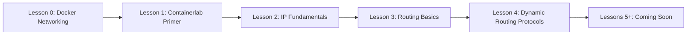

# Containerlab Training Series

Network fundamentals for DevOps engineers using containerlab.

## Series Overview

This series teaches networking concepts through hands-on labs using containerlab. Each lesson builds practical skills while introducing automation tools.



## Lessons

| # | Title | Focus | GitOps Tool |
|---|-------|-------|-------------|
| 0 | [Docker Networking Fundamentals](00-docker-networking/) | Bridge, host, namespaces | Docker Compose |
| 1 | [Containerlab Primer](01-containerlab-primer/) | Setup, topology files, first lab | Git |
| 2 | [IP Fundamentals & Connectivity](02-ip-fundamentals/) | Addressing, subnets, ping | Ansible intro |
| 3 | [Routing Basics & Static Routes](03-routing-basics/) | Static routes, routing tables | Ansible playbooks |
| 4 | Dynamic Routing Protocols | Coming soon | TBD |

## Learning Path

### Foundation (Lessons 0-3)
Start here. These lessons build core skills:
- Docker networking concepts
- Containerlab basics
- IP addressing and connectivity
- Static routing and troubleshooting

### Dynamic Routing (Lesson 4)
- Dynamic routing protocols (BGP, OSPF)

### Future Lessons
Additional lessons are in development. Check back for updates.

## How Each Lesson Works

### Structure

```
XX-lesson-name/
├── README.md           # Start here - objectives, outline
├── topology/           # Containerlab topology files
├── configs/            # Device configurations
├── exercises/          # Hands-on exercises
├── solutions/          # Exercise answers
├── tests/              # Automated validation
└── script.md           # Video script
```

### Workflow

1. **Watch** the video lesson
2. **Read** the README for objectives
3. **Deploy** the lab: `sudo containerlab deploy -t topology/lab.clab.yml`
4. **Complete** exercises in `exercises/`
5. **Validate** with `uv run --project ../../.. --group test pytest tests/ -v`
6. **Destroy** the lab: `sudo containerlab destroy -t topology/lab.clab.yml --cleanup`
7. **Commit** your work to your fork

## Prerequisites

Before starting this series:

- [ ] Comfortable with containers, Linux CLI, and Git ([Getting Started](../../docs/getting-started.md))
- [ ] Tools installed ([Getting Started](../../docs/getting-started.md))
- [ ] Forked this repository ([Getting Started](../../docs/getting-started.md#fork-and-clone))

## Time Commitment

- **Per lesson:** ~30-45 minutes (video + exercises)
- **Full series:** ~6-8 hours
- **Self-paced:** Complete over days or weeks

## Getting Help

1. Check [Troubleshooting Guide](../../docs/reference/troubleshooting.md)
2. Review [Containerlab Cheatsheet](../../docs/reference/containerlab-cheatsheet.md)
3. Ask in course Discord/Slack
4. Open GitHub issue for course bugs

## Start Learning

Ready? Begin with [Lesson 0: Docker Networking Fundamentals](00-docker-networking/).

Already comfortable with Docker networking? Skip to [Lesson 1: Containerlab Primer](01-containerlab-primer/).
